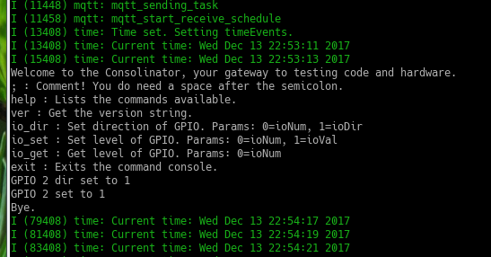
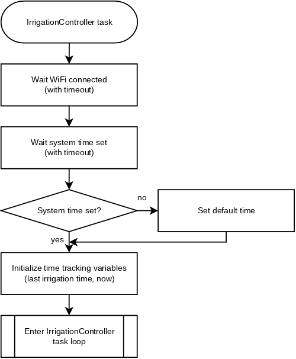
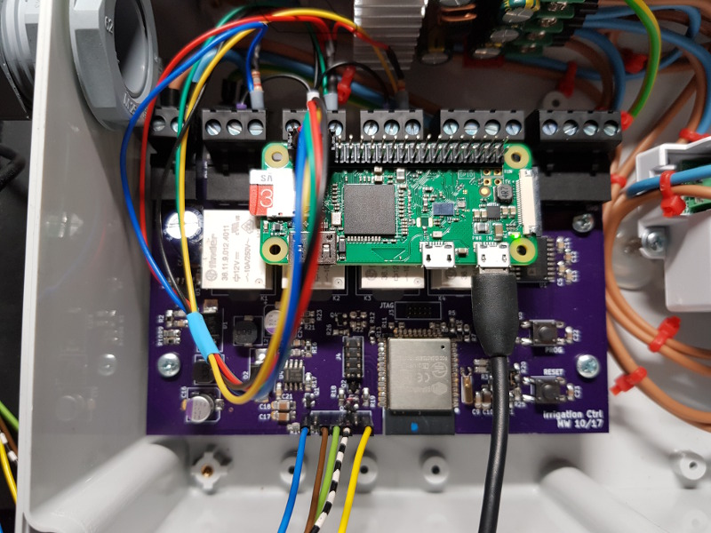

# Irrigation Controller

This is the software repository for the Irrigation Controller project.

The hardware repository of the project can be found there: [https://github.com/mwick83/irrigation_ctrl_hw](https://github.com/mwick83/irrigation_ctrl_hw)

I also blog about the project on [my website](https://www.matronix.de/tag/iop/) under the hashtag #IoP - Internet of Plants. Some of the documentation here is a compressed version of the already existing or future blog posts there.

## Introduction

Let's face it: I'm a poor gardener. My main problem: Forgetting to water the plants. I'm thinking about this problem for many years now. Many ideas came to my mind, but I didn't actually start something in this regard.

In 2017, sometime between spring and summer, I stumbled across the Gardena MicroDrip system. It's a starter-kit that uses a (indeed very very small) pump within some sort of water reservoir. The last part was pretty important, because my balcony has no direct water tap. The kit came with some pipe, some drippers, the water pump and a very basic controller. The controller is able to do some fixed-interval programs, but you can't freely program it.

## Goals

I'm aiming at more flexibility in regard to watering the plants. The basic idea is still to use fixed intervals, but drop waterings in case of rain or extend the watering time if the sun was shining heavily.

In the first step, I'm going to implement just the fixed interval watering. That's more or less what the simple Gardena controller can do, but with the addition of monitoring the water reservoir. This will allow me to receive alarms, when the water level is too low. Additionally, the pump won't run dry anymore as it does with the Gardena controller.

The second step will be adding more advanced logic to make the watering more flexible. The basic idea will be to still to use fixed intervals, but drop waterings in case of rain or extend the watering time if the sun was shining heavily. I'm planning to address this step much later this year.

## Hardware platform

My hardware platform is based on an ESP32. I designed a base board with some relays, power supply, UART interfaces (for sensors, e.g. the fill level sensor for the reservoir) and the ESP-WROOM-32 module.


On the top edge of the board are connectors for power, the relay outputs and the UARTs. The connectors are screw terminals which can be disconnected without loosening the screws, which might be handy when installing the hardware in its IP67 enclosure.

The design has two switching regulators: The first one is the main regulator for the 3.3V I use to power the ESP32 and all other digital stuff on the board. The second regulator is used to power the relays and external sensors. This regulator is normally off and can be activated via a GPIO of the ESP32. The UART level-shifters are also held in standby by default and can be powered up by the ESP32 on demand. I did this to reduce the power consumption as much as possible. I plan on driving the whole system on solar power sometime in the future. That's also the reason why I connected an ADC channel to the power input for voltage monitoring.

The reservoir fill level sensor (which is another project on its own) will be connected to one of the UARTs. Measurements will be triggered via a simple command/response scheme. I decided to decouple the two projects to try out different approaches for measuring the fill level in the real world. With the use of a generic command interface it doesn't matter how the level is actually measured.

## Current state

Hardware-wise, most of the board is tested:

* The switching regulators are working. The second regulator can be switched on and off on demand.
* The ESP is flashable and executes code.
* The relays can be controlled by the ESP.
* The battery voltage can be measured.
* The RS232 chip has been tested with a UART connection to the reservoir fill level sensor.

The software has also taken shape:

* A command console via the debug/programming UART is implemented for testing purposes.
* The fill level sensor protocol handler is implemented and tested.
* WiFi connects properly to my home WLAN. I'm planning to implement a WiFi manager class to encapsulated it better.
* An MQTT client connects to my local broker. An MQTT manager class handles (potential) multi-threading. It's currently only possible to publish messages.
* The real time clock of the ESP is keeping the time when the ESP is in deep sleep to preserve power. The time system is able to sync with an SNTP server, but the time can also be set via the command console.
* The control logic for the fixed irrigation plan is implemented in the IrrigationController class. The class uses the IrrigationPlanner and IrrigationEvent classes to keep track of irrigation events.

The configuration of the WiFi and other services is currently hardcoded in the file include/networkConfig.h. The repository contains a template version of the file. I'm planning to change the configuration mechanism either by providing console commands or by implementing a webserver.

Sadly, the reservoir fill level sensor has proven to be unreliable. I was planning to use a voltage measurement over a voltage divider, which is influenced by the number of gold contacts covered in water. It's starting to go crazy when the pump is turned on.

That's the reason why I implemented configuration options to disable battery monitoring and/or reservoir fill level monitoring. If one is disabled, it will not take part in the decision if an irrigation should take place or not. This not only allows continuing with the development regardless of the fill level sensor, but it also adds more flexibility in the hardware setup.



The screenshot above shows an early debugging session using the command console. You can see that an MQTT connections as been established and the time has been synced with an SNTP server. I tested some GPIO functionality in the session.

## Control logic details

As mentioned earlier, the control logic is implemented in the IrrigationController class. Because it usually is hard to describe program flow details in text form, I created some flow charts. They are not 100% accurate, i.e. they leave out some details and are drawn a little different than actually implemented for better "readability".

The logic is implemented within a (FreeRTOS) task. I chose using a task to have the flexibility to keep the controller running all the time (e.g. in the development and configuration phase) or run the task just once every "now and then" and put the processor into deep sleep most of the time.

The following flow chart shows the initialization phase of the task. There is nothing special there: It basically waits for WiFi and the system time being set. Both waiting times do have a timeout. That is to ensure the controller tasks comes up without a network connection.



After initialization the task enters its task loop. It doesn't explicitly exit it ever. The only time it "exits" is when the processor enters deep sleep, because a wakeup from this state will reboot the system right from the very beginning.


In essence, the task loop does the following:

* Collect (internal and external) sensor data.
* Check for critical conditions (and disable an active irrigation if detected).
* Process all irrigation events that (may have) occurred since the last loop run. This ensures that no event will be missed, even if the task loop run gets scheduled a little too late by the OS.
* Publish the current state (i.e. sensor data and irrigation event info) via MQTT (if a network connection has been established).
* Decide whether to deep sleep or to "lightly" sleep by a task delay/yield.

### Testing the control logic

To test the control logic over several days, I setup a data logger on a Raspberry Pi Zero-W board. It's hooked up via its GPIOs to the relay outputs of my board.



I'm using a slightly modified version of the gpio-monitor found on the [Raspberry Pi community forum](https://www.raspberrypi.org/forums/viewtopic.php?f=37&t=19346). Other than that, a serial monitor connected to the debug console is logging the debug output of the controller itself as well. That should give some insight in case something goes wrong.

Here's an example of logged events (time is displayed in UTC):

```plaintext
2018-03-11@06:00:00.59 010
2018-03-11@06:00:15.62 110
2018-03-11@06:00:20.65 111
2018-03-11@06:01:00.74 011
2018-03-11@06:01:15.78 001
2018-03-11@06:01:20.80 000
```

The start of each line displays the date and time the monitored GPIOs have changed. The next three digits show the current state of the three monitored GPIOs. They represent the state of the MAIN, AUX0 and AUX1 relay outputs (left to right).

### MQTT info

Each control loop run will publish a state info via MQTT to a configured MQTT broker. The info is published in JSON format and currently looks like that:

```JSON
{
    "batteryVoltage": 12554,
    "batteryState": 1,
    "batteryStateStr": "OK",
    "reservoirFillLevel": -2,
    "reservoirState": 3,
    "reservoirStateStr": "DISABLED",
    "activeOutputs": [],
    "activeOutputsStr": [],
    "nextIrrigationEvent": "2018-03-21 07:00:00",
    "sntpLastSync": "2018-03-20 21:14:59",
    "sntpNextSync": "2018-03-21 01:14:59"
}
```

The state info contains internal and external sensor data as well as system state data:

* The battery voltage in mV and a state representation (as an integer value and a string, i.e. CRITICAL, LOW, OK, FULL and DISABLED)
* The reservoir fill level in percent multiplied by 10 and a state representation (as an integer value and string, i.e. CRITICAL, LOW, OK and DISABLED).
* Information about currently active outputs (as integer values and strings).
* Date and time of the next occurring irrigation event based on the currently set date and time.
* Date and time of the last and next SNTP sync.

I have chosen to publish the voltage and reservoir fill level in mV and "percent multiplied 10" to prevent the usage of floating point variables as much as possible.

## Compiling and running

The project is a plain ESP-IDF project. It provides a good way to include external components into the compile flow. They are either included as git submodules or simple sub directories in the 'components' dir.

ToBeDone: Document the following steps:

* git checkout with submodules
* setting ESP-IDF environment
* compile
* flash + run
* connect to debug console

## Third party software components

The following projects are used as additional components. Some of them are from third parties or forked versions of third party components/libraries:

* [console-esp32](https://github.com/mwick83/console-esp32): The command console. It is based on [Elecia White's command console](https://github.com/eleciawhite/reusable/) and was ported by me to the ESP32 and lives in my gitub repository. The original code was published in the public domain. Be sure to check out her embedded software engineering podcast [Embedded.fm](http://embedded.fm/). Thanks Elecia!
* [espmqtt](https://github.com/mwick83/espmqtt): The MQTT client library by Tuan PM. I forked it to modify its configuration mechanism. You can find the [original repo here](https://github.com/tuanpmt/espmqtt). It is licensed under the Apache-2.0 license.

The following components are implemented by me and have their own github repositories:

* [mqtt-manager-esp32](https://github.com/mwick83/mqtt-manager-esp32): The MQTT client manager used to handle multi-threading properly.

## License

Copyright (c) 2017-2018 Manuel Wick

Licensed under the BSD 3-clause "New" or "Revised" License.
See LICENSE.md file or [http://www.opensource.org/licenses/BSD-3-Clause](http://www.opensource.org/licenses/BSD-3-Clause) for details.
